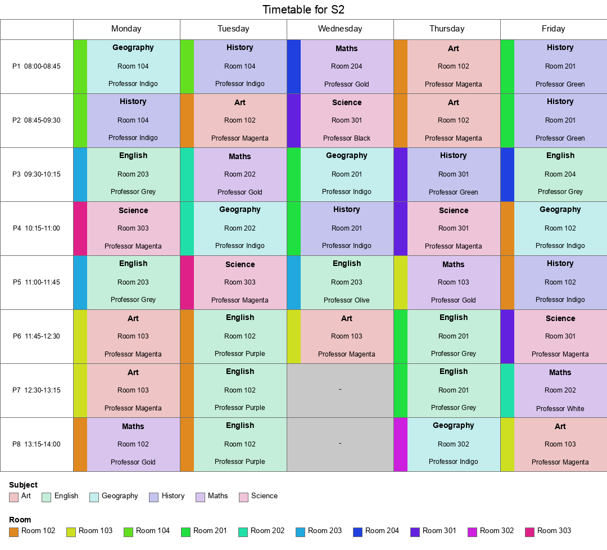

# z3

[z3](https://www.microsoft.com/en-us/research/project/z3-3/) is a constraints solver - it's got a fancy title "Satisfiability Modulo Theories", but basically allows you to express problems in certain logical ways, and quickly and efficiently solve them.

There are [online playgrounds](https://microsoft.github.io/z3guide/) and support for various languages. I'm using Python's `z3` ... I see [z3-solver](https://github.com/z3prover/z3) shows up more easily in searches. Oh, they are the same, it's just the import is simpler.

I ran into it last year during [Advent of Code](https://adventofcode.com/2025/day/10) - the second part of that day had a tree searching problem which was vast. I'd written code to solve the first part, I could see it wouldn't work for the second, so I went hunting for alternative approaches.

I've been wanting to take a proper look at it again - I don't have a need for it at work, sadly, but I have a long-standing project to explore in the back of my head : my dad was a headmaster, and used to set timetables every summer. I wonder if we can use `z3` to solve it.

Let's build up some knowledge from scratch.

## examples

### trivial

```
    x = Int('x')
    solve(x + 2 == 4)
```

You can test if there was a solution (it's `2`, by the way) by expanding it a bit more:

```
    x = Int('x')
    s = Solver()
    s.add(x + 2 == 4)

    if s.check() == sat:
        m = s.model()
        return  m[x].as_long()
    else:
        return None
```

[Example 0](./example0.py)

### trivial only less so

```
x > 2, y < 10, x + 2*y == 7
```

[Example 1](./example1.py)

### making change - dumb

First the dumb version - can we simply make change for a given amount from certain coins ? In my example,
I don't have pennies - so only numbers divisible by 5 work. But the solutions are dumb - making 50c with 5x10c counts, rather than two quarters. (Don't know why not 10x5c ?)

[Making Change - Dumb](./making_change_dumb.py)

### making change - optimisation

Now we add some optimisation in : the minimal number of coins, now including pennies.

[Making Change](./making_change.py)

### advent of code

The puzzle on day 10 of 2025 (https://adventofcode.com/2025/day/10) caused a fuss. You can solve part 2 in various ways, but doing it with Z3 was trivial - should it be allowed.

Basically you have a bunch of buttons to press, each of which changes the voltage in certain ways - what's the minimum number of presses needed to do a certain thing ? Technically possible from first principles, but vast search space : I had code to do it, but I could see it wasn't go to finish in my lifetime.

But I liked it, because I got to learn how to use z3.

[AoC2025.10](./advent-of-code/2025-10.1-optimise.py)

### course planner

Now I'm working up to the actual example I want to solve.  Here's a halfway step.

I'm a student at a university. I want to first list all combinations of courses offered that I could take - they happen on certain days and times, and I need to avoid clashes - and then second optimise it, so I'm spending the most possible time in class (doh !)

The course data looks like this:
```
{
        "id": 100,
        "name": "Course 100",
        "schedule": [
            "Monday 3:00-4:00",
            "Tuesday 2:00-3:00",
            "Wednesday 2:00-3:00",
            "Thursday 2:00-3:00"
        ]
    }
```

Now **Claude** enters the chat. I handwrote the [course data generator](courses/generate_course_data.py) and then got Claude to write the other two scripts, possibles and best.

For the [combinations](courses/generate_combinations.py), it did something clever - it generated a list of conflicts - double nested loop though courses, and note which pairs share a time slot. This can be used as a constraints to limit which combinations are allowed.

_And this is where the current Ai models are so worth it_ ... because I can then ask Claude to explain, slowly and patiently, what it's doing. Which is basically solving the problem, getting the first solution, _then adding a new constraint_ saying "don't give me this one again ..."

Clever.

The second part basically [optimises](courses/generate_max_time_combinations.py) for the highest time in class, and then iterates through to find all combinations that match it. And with the small data set, there was one option.

```
┌─────────────┬──────────┬───────────┬───────────┬──────────┬──────────┐
│    Time     │  Monday  │  Tuesday  │ Wednesday │ Thursday │  Friday  │
├─────────────┼──────────┼───────────┼───────────┼──────────┼──────────┤
│ 9:00-10:00  │          │ Course 10 │           │ Course 5 │          │
├─────────────┼──────────┼───────────┼───────────┼──────────┼──────────┤
│ 10:00-11:00 │ Course 7 │           │ Course 7  │          │ Course 7 │
├─────────────┼──────────┼───────────┼───────────┼──────────┼──────────┤
│ 11:00-12:00 │ Course 8 │           │           │          │ Course 8 │
├─────────────┼──────────┼───────────┼───────────┼──────────┼──────────┤
│ 1:00-2:00   │          │ Course 7  │           │ Course 3 │          │
├─────────────┼──────────┼───────────┼───────────┼──────────┼──────────┤
│ 2:00-3:00   │ Course 9 │ Course 5  │ Course 3  │ Course 8 │ Course 5 │
├─────────────┼──────────┼───────────┼───────────┼──────────┼──────────┤
│ 3:00-4:00   │ Course 3 │ Course 3  │ Course 10 │ Course 7 │          │
└─────────────┴──────────┴───────────┴───────────┴──────────┴──────────┘
```

Nice.

### finally, the timetable

My dad was a headmaster and every summer he would have to disappear into his office and set the timetable. Our schools would have a fixed number of classrooms; a fixed number of teachers with certain skills (mostly one subject, sometimes two); a fixed number of classes, which had certain students in them. Including me. And each class needs to be taught certain subjects.

Now: we can - at this point - ignore the students in each class. And there will be more classrooms than classes. I might add a constraint later that certain subjects can only happen in certain rooms. And in reality, certain teachers could only teach certain classes - a primary school teacher couldn't teach seniors.

But I will add the obvious constraint that each class needs to have a lesson in every period : 8 periods in a day.

I've got 10 classes - so I need at last 10 teachers. Let's give me 15 teachers and 15 rooms - ah, the good old days, when education was important. And funded.

I asked Claude to create some teachers - and it's being sneaky, it can see where I'm going.

```
Created timetable/generate_teachers.py and ran it to produce timetable/teachers.json.

- It reads classes.json and collects all 12 distinct subjects taught anywhere (English, Maths, Science, Geography, History, Art, Biology, Chemistry, Physics, Geology, Economics, Business Studies).
- Generates 15 teachers named "Professor <Color>" (unique colors, no repeats), each assigned 1–3 subjects at random.
- Guarantees every subject has at least one qualified teacher (adjusting a random teacher's list if a subject was missed by chance) — otherwise a timetable solver could hit an unsatisfiable subject later.

Result: 15 teachers generated, all 12 subjects covered, saved to timetable/teachers.json.
```

Took 1m 13s to write the first script, to return "a" timetable.

I came up with a good way to optimise it, and Claude added the appropriate flexible code for soft optimisations. Here I ran into my first real problem - hi Dad ! - the solution space is vast. So Claude suggested a time constraint and to track "the best so far"
...

Not sure this is going to work. If not, I will drop the teachers and rooms : I only have 10 classes.

Ah, Claude suggests an improvement.

```
Found the real problem: a timed-out Optimize model isn't safe to use — variables Z3 never got around to pinning get filled in independently by "model completion," which can silently violate joint constraints like Distinct (I confirmed this: the "optimized" timetable had 10 classes sharing one teacher per slot, breaking the no-double-booking rule). I need a sounder approach: only ever trust models from a sat result, never unknown.

I'll switch to iterative "solve, then strictly beat this score, repeat" using a plain Solver under a time budget — every accepted answer is a genuine sat result, so it's always valid; we just stop improving once we run out of time or provably hit the optimum.
```

Now we're getting solutions in 30 seconds. I've tried a 5 minute run, and it hasn't improved further.

It generates lots of output: both markdown ... here's Professor Black.

| Period | Time | Monday | Tuesday | Wednesday | Thursday | Friday |
|--------|------|------|------|------|------|------|
| 1 | 08:00-08:45 | S3<br>Chemistry<br>Room 204 | *Free* | S3<br>Chemistry<br>Room 302 | *Free* | *Free* |
| 2 | 08:45-09:30 | *Free* | *Free* | *Free* | *Free* | *Free* |
| 3 | 09:30-10:15 | S3<br>Chemistry<br>Room 203 | *Free* | *Free* | S3<br>Chemistry<br>Room 301 | *Free* |
| 4 | 10:15-11:00 | *Free* | *Free* | *Free* | *Free* | *Free* |
| 5 | 11:00-11:45 | *Free* | *Free* | S3<br>Chemistry<br>Room 204 | *Free* | S3<br>Chemistry<br>Room 301 |
| 6 | 11:45-12:30 | S3<br>Chemistry<br>Room 301 | *Free* | *Free* | *Free* | *Free* |
| 7 | 12:30-13:15 | S3<br>Chemistry<br>Room 204 | S3<br>Chemistry<br>Room 301 | - | *Free* | S3<br>Chemistry<br>Room 301 |
| 8 | 13:15-14:00 | *Free* | *Free* | - | *Free* | *Free* |

... wow, he has a lot of free time ...

Discussing further with Claude, it suggests optimizing each day individually - fair enough, give it a whirl.

And now it will return a provably optimum solution (for those constraints) ... only it didn't, and Claude is very apologetic.

Let's add a constraint : only certain rooms support Science, and the three sciences. And another room is needed for Art.

Ok, that improved it signficantly - faster, and better score.

But then - foolish, in hindsight - we tried to make it better. I noted that most teachers had 38 lessons, but Professor Black had just 7. Yes, he is a Chemistry teacher, but even so, could we make this fairer ?

Claude picked the wrong way to do it, I think - implementing a max load, which in turn meant there turned out to be no valid solutions. (I note that it's trying to get any solution first, before then trying to get a good one - which is a good approach.) From reading it's thinking, it's not sure why this is failing - it should be working. It added a cap of 38 - which is a full week - and it still timed out indicating the constraints are broken / interfering with each other.

But it came up with a new approach, instead of a max load, go for a min load - and got a quick solution. That then meant we could then try and improve it further - and we did. That's doubled his load.

| Period | Time | Monday | Tuesday | Wednesday | Thursday | Friday |
|--------|------|------|------|------|------|------|
| 1 | 08:00-08:45 | *Free* | S3<br>Chemistry<br>Room 302 | *Free* | *Free* | *Free* |
| 2 | 08:45-09:30 | *Free* | S3<br>Chemistry<br>Room 302 | S3<br>Chemistry<br>Room 302 | S3<br>Chemistry<br>Room 301 | *Free* |
| 3 | 09:30-10:15 | S3<br>Chemistry<br>Room 303 | *Free* | *Free* | *Free* | S3<br>Chemistry<br>Room 303 |
| 4 | 10:15-11:00 | S3<br>Chemistry<br>Room 303 | *Free* | *Free* | S3<br>Chemistry<br>Room 303 | *Free* |
| 5 | 11:00-11:45 | *Free* | *Free* | *Free* | *Free* | S3<br>Chemistry<br>Room 303 |
| 6 | 11:45-12:30 | S3<br>Chemistry<br>Room 302 | *Free* | *Free* | *Free* | *Free* |
| 7 | 12:30-13:15 | *Free* | S3<br>Chemistry<br>Room 301 | - | S3<br>Chemistry<br>Room 302 | *Free* |
| 8 | 13:15-14:00 | S3<br>Chemistry<br>Room 301 | *Free* | - | S3<br>Chemistry<br>Room 303 | *Free* |

Later on I asked Claude how to fix this - and basically it's time for Professor Black to go and do some training ;-)

```
Fix: searched all 28 candidate single-teacher/single-subject additions and found the best one — giving Professor Black a Science qualification raises the achievable ceiling from 173 to 223 (out of a theoretical max of 236), and as a side effect frees up Navy/Maroon/Pink's bandwidth too, lifting S3 from 15/38 to 32/38 even though S3 doesn't even take Science.
```

### cp-sat and Google

Around this time, Claude started telling me about Google's [CP-SAT](https://developers.google.com/optimization/cp/cp_solver) solver as being better for this specific task - `z3` is good for a range of constraint modelling, `cp-sat` is specific on scheduling.

So I got Claude to implement the same problem with this new library - a big download.

It worked really well - first finding the root problem with optimising the timetable, and then generating better solutions in seconds. I eventually saw from my diagrams that it was "cheating" and putting blocks of lessons together, so a class would do the same subject all day with the same teacher in the same room. That would be very boring - so I added a constraint that each class has to have each subject each day, and that was better.



## conclusions

A good use of an evening, learned heaps. Lots more to do, will see if I can revisit this again.

## blog posts from Claude

This page is all human-written, but I got Claude to write up 3 blog posts with diagrams.

[Story](timetable-story.md) : the long story of what I did on that Saturday evening with the rain outside and the fire lit.

[Timetable](timetable-generation.md) : a more focussed exploration of building up the timetable, all on `z3`

[CPSat](timetable-cpsat.md)

## presentations

https://theory.stanford.edu/~nikolaj/nus.html#/sec-z3 gets into maths quickly.

## specific example (not z3)

https://medium.com/suboptimally-speaking/school-timetabling-with-constraint-programming-495f1126c28d

https://developers.google.com/optimization/scheduling/employee_scheduling

## older stuff

https://ericpony.github.io/z3py-tutorial/guide-examples.htm

This has a max/min example:

https://www.cs.toronto.edu/~victorn/tutorials/z3/SMT.html
