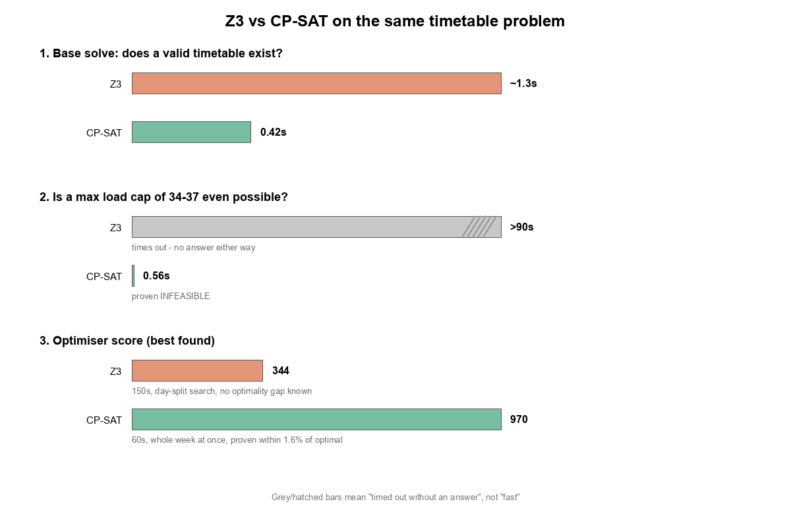
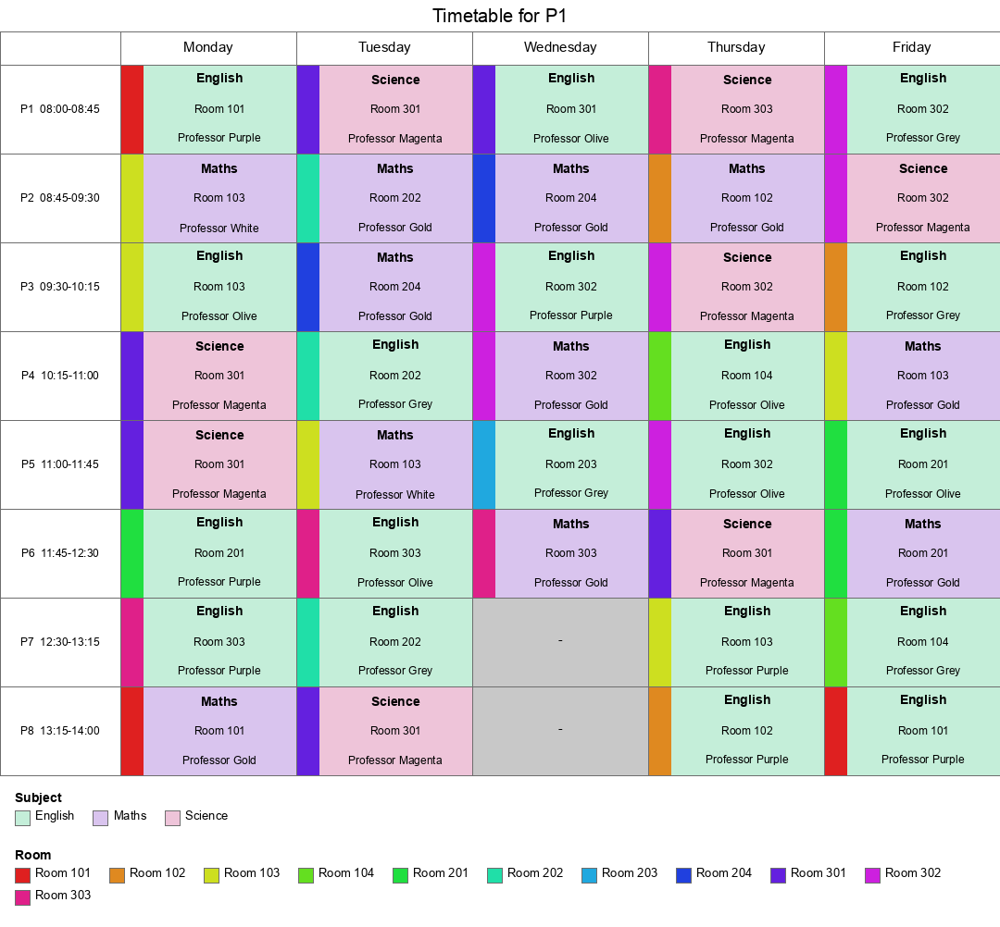
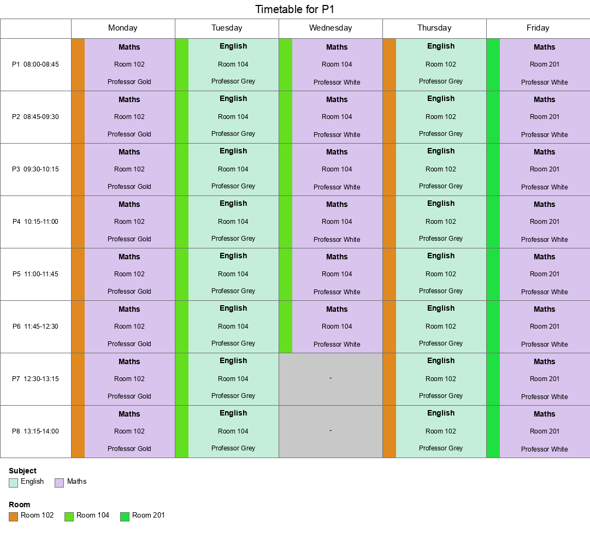
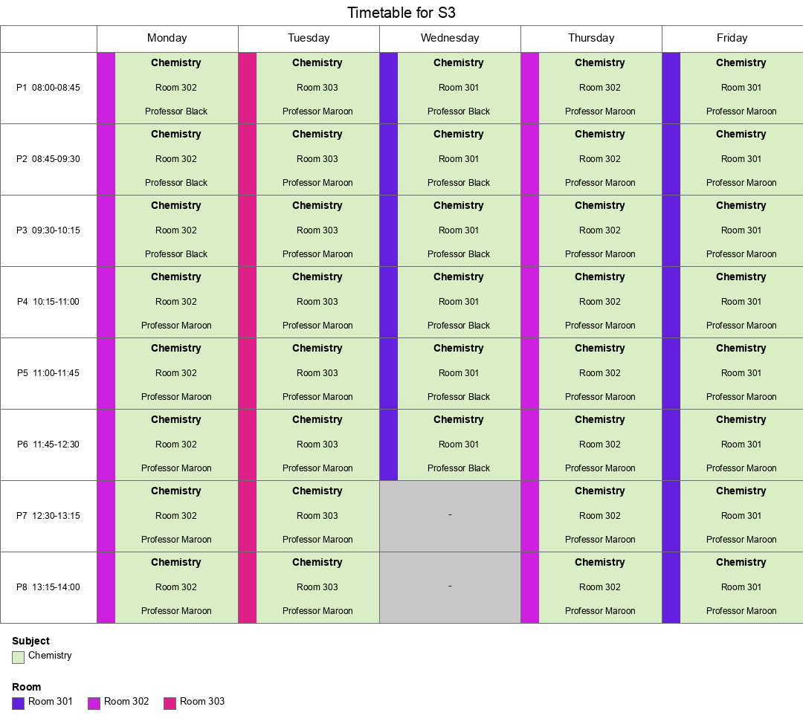
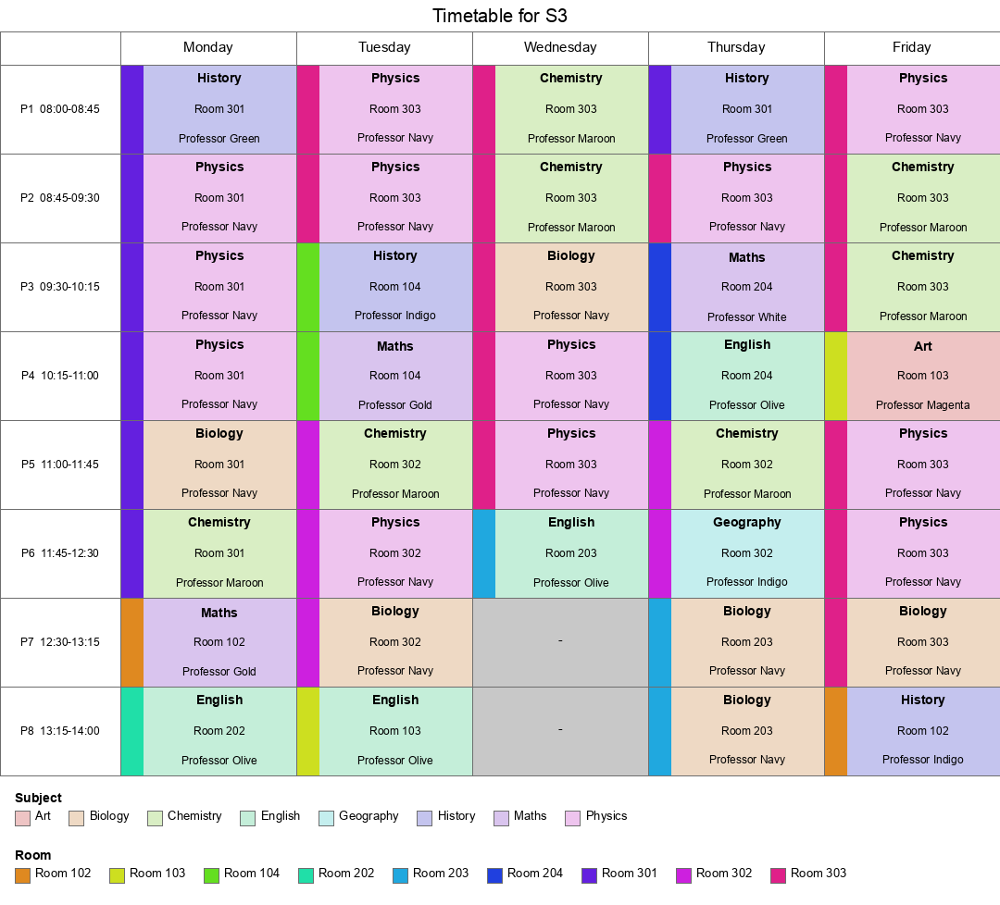

# Same Problem, Different Solver: Trying Google OR-Tools CP-SAT Against Z3

The two earlier posts in this series told the story of building a school timetable solver in Z3, and along the way, a couple of things kept turning up that felt less like bugs in the *model* and more like friction with the *tool*: an `Optimize()` timeout that couldn't be trusted, a cap constraint that made the solver time out even when it was already true by construction, an optimiser that could never say how close to optimal its answer actually was. None of that was wrong, exactly - Z3 is a general-purpose SMT solver, built to reason about a huge range of logics (arithmetic, bit-vectors, arrays, uninterpreted functions, quantifiers...), not specifically about rosters and schedules.

So the obvious experiment: take the *exact same problem* - same classes, teachers, rooms, subjects, hard rules and soft scoring rules - and solve it with [Google OR-Tools' CP-SAT](https://developers.google.com/optimization/scheduling/employee_scheduling) instead, a constraint-programming solver built specifically for exactly this shape of problem (assignment, scheduling, covering, cardinality). This post is what happened.

## Porting the model

The hard constraints translated almost line for line, but each one landed on a more specific, more purpose-built tool than the general one Z3 offered:

**"This class can only be given a subject it takes, taught by a teacher qualified for it, in a room that supports it"** used to be a big `Or` of `And`s in Z3:

```python
s.add(Or([
    And(subject_var == s_idx, teacher_var == t_idx)
    for s_idx, t_idx in valid_subject_teacher_pairs[class_name]
]))
```

In CP-SAT this is a single **table constraint** - hand the solver the whole list of allowed `(subject, teacher, room)` triples directly, and it reasons over the table natively instead of unpacking a big boolean formula:

```python
model.AddAllowedAssignments([subject_var, teacher_var, room_var], valid_triples[class_name])
```

**"No teacher or room can be double-booked"** was `Distinct(...)` in Z3; in CP-SAT it's `AddAllDifferent(...)` - same idea, but backed by a solver whose whole design centres on scheduling-style covering and matching constraints like this one.

**Counting how often a pattern happens** - the basis of every soft scoring rule - needed the biggest change. Z3 lets you write `If(condition, 1, 0)` inline, anywhere, and its `Sum()` just adds them up:

```python
terms.append(If(And(room_now != -1, room_next != -1, room_now == room_next), 1, 0))
```

CP-SAT has no direct equivalent - instead you build a boolean variable and *reify* it, meaning you explicitly state what has to be true when it's true, and what has to be true when it's false:

```python
same = model.NewBoolVar(name)
model.Add(room_now == room_next).OnlyEnforceIf(same)
model.Add(room_now != room_next).OnlyEnforceIf(same.Not())
```

More verbose, rule by rule - but it paid for itself immediately on the one rule that needed an absolute value and a division (the "spread lessons evenly" fairness rule), where CP-SAT's native `AddAbsEquality` and `AddDivisionEquality` replaced a page of hand-built `If()` logic Z3 needed for the same thing.

The pay-off for that verbosity: the day-splitting workaround and the hand-rolled "solve, then demand something strictly better, repeat" search loop - both built specifically to route around Z3 limitations - simply weren't needed any more. CP-SAT's own `Maximize()` plus a time limit already reports a genuine, trustworthy status: `OPTIMAL` means proven best possible, `FEASIBLE` means "here's the best I found, and here's a computable gap to the true optimum." That's real, structural code that disappeared, not just a performance tweak.

## The results



**1. Does a valid timetable exist at all?** Both solvers say yes, easily - Z3 in about 1.3 seconds, CP-SAT in 0.42. A modest win, and on its own not a reason to switch anything.

**2. Is a maximum teacher-load cap of 34-37 lessons/week even achievable?** This is where it stopped being modest. Z3 couldn't answer this question at all - three different ways of encoding the cap all timed out past 90 seconds with no result, `sat` or `unsat`. CP-SAT answered in 0.56 seconds: **infeasible**, definitively proven, every time. That's not "CP-SAT found the same answer faster" - Z3 never found an answer.

**3. The optimiser's score.** Z3's best result, after 150 seconds spread across a day-by-day search built specifically to make the problem more tractable, was **344** - and no way to know how far that was from the true best. CP-SAT, solving the whole week in one go with no special-casing, reached **970** in 60 seconds, and reported that the true optimum is at most 986 - **within 1.6% of optimal, proven**. Roughly 2.8x the score, in 40% of the time, with a confidence figure the Z3 version could never produce.

The quality difference shows up visually too. Here's the same class's Monday-to-Friday schedule from each optimiser's best result:





The CP-SAT version keeps P1 in the *same room all day, every day* - Room 102 on Monday and Thursday, Room 104 on Tuesday and Wednesday, Room 201 on Friday. That's rule1 and rule3 (room continuity) essentially maxed out, not just nudged in the right direction.

**4. A daily-variety rule, and the same investigative pattern paying off again.** A later look at the diagrams found something the score never flagged: some classes were getting the *same single subject* for every period, every day. Adding a rule to reward daily variety barely helped at first - which turned out not to be a weighting problem at all. Making that rule CP-SAT's *only* objective, with nothing else competing for priority, proved the true ceiling was exactly 173 (out of a possible 236), solved to `OPTIMAL` in 1 second. No amount of extra weight was ever going to move a number that a solver had already proven was the hard maximum - the same lesson from the load-cap experiment, just showing up somewhere new.



Testing the obvious suspect - the 3 shared lab rooms - directly (temporarily giving those subjects 5 rooms each instead of 3) changed nothing at all. The real cause was the teacher-saturation fact from the bonus discovery below, showing up in practice: two classes (S3, S4) can only ever be taught by the 4 teachers who aren't already fully booked elsewhere, and those 4 only know 5 of the school's 12 subjects between them. Searching all 28 ways of adding one subject to one of those 4 teachers found the best fix - giving one teacher a Science qualification lifted the ceiling to 223, and CP-SAT reached 219 of it in the same 60-second budget:



Z3, re-run on the identical new rule and roster, improved too (S3 from 11/38 to 20/38, S4 from 10/38 to 23/38) but nowhere near as far as CP-SAT's 32/38 and 31/38 on the same inputs - the same day-split search limitation from result 3, showing up again on a different rule.

## The bonus discovery

Chasing down *why* the load cap was infeasible turned into the most interesting result of the whole experiment. Using CP-SAT's `Minimize()` on each teacher's weekly load individually (each check taking well under a minute) showed that 8 of the school's 12 teachers have a **minimum possible load of exactly 38** - every single period of the week, in *every* valid timetable, no exceptions. Only 4 teachers (the ones covering the extra subjects only two classes take - Biology, Chemistry, Physics, Geology, Economics) have any real flexibility at all.

The reason is a textbook example of Hall's marriage theorem: eight of the ten classes (P1 through P6, S1, S2) have subject lists that, between them, are only ever teachable by exactly eight specific teachers - no more, no fewer. There's no slack in that group at all, so all eight of those teachers must be booked in every period, forever. It's a fact about the *data*, not the *solver* - but it took a solver that could answer an infeasibility question in half a second, rather than time out after ninety, to actually find it.

That same fact turned out to have a direct, practical consequence a little later (see result 4 above): the two classes outside that group of eight, S3 and S4, are entirely dependent on the four teachers who *aren't* in it - which is exactly why they kept getting stuck repeating the same one or two subjects all week, and exactly what pointed at the fix.

## What this doesn't mean

It would be easy to read all this as "CP-SAT is just better than Z3" - it isn't, it's better *at this*. Every one of Z3's rough edges here came from asking a general-purpose SMT solver to do a job that a purpose-built constraint-programming solver is specifically optimised for: cardinality constraints, all-different constraints, table-constrained assignment. Z3 remains the right choice the moment a problem needs the theories CP-SAT simply doesn't have - bit-vectors, arrays, uninterpreted functions, quantifiers, anything closer to program verification than to rostering. The lesson isn't "always use CP-SAT" - it's that a solver's *design center* matters as much as its correctness, and it's worth checking whether a problem's *shape* already matches a more specialised tool before spending more effort tuning a general one.

For a school timetable, though - full of exactly the double-booking, covering, and cardinality constraints CP-SAT was built for - the difference was never close.
