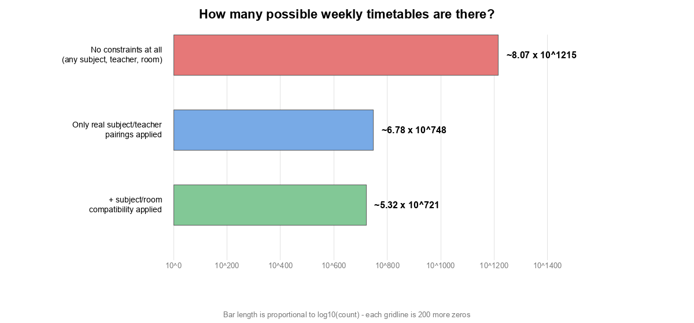
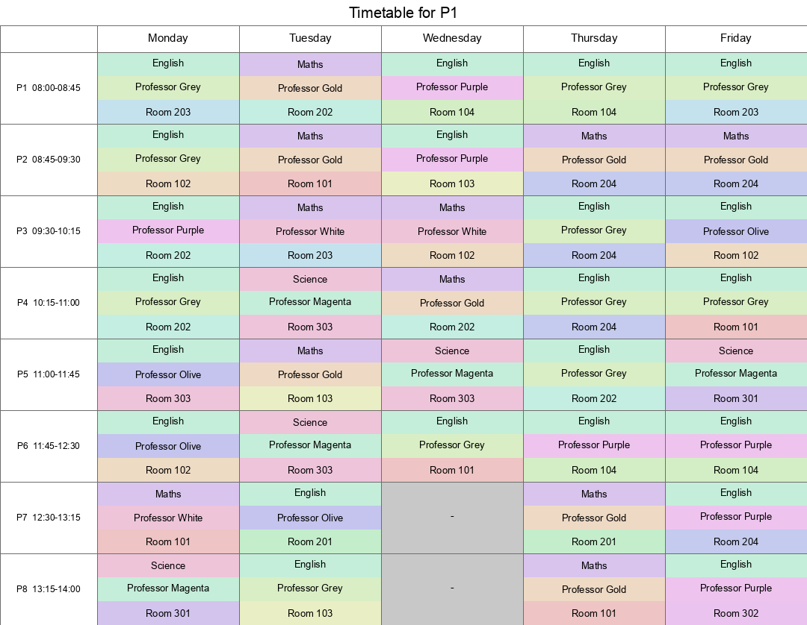

# Inside the Timetable Problem: From an Impossible Number to a Working Schedule

This post is a close-up on one specific problem from the wider Z3 project: generating a working weekly school timetable. It covers what the problem actually is, exactly how big the search space is if you don't think carefully about it, and how the solution was refined step by step from "does *any* timetable exist" to "here's a good one, and here's why nobody's being treated unfairly."

## The problem

A school has:

- a set of **classes**, each of which can be taught a fixed list of subjects (a class doesn't have to do *every* subject every week, but it can only ever be taught something from its own list)
- a set of **teachers**, each qualified to teach only a handful of subjects
- a set of **rooms**, some of which are only suitable for certain subjects (you can't teach Chemistry without a lab)
- a fixed weekly grid of **periods** - five days, most with eight periods, except a half-day Wednesday with six

The job: assign every class a subject, a teacher, and a room for every single period of the week, such that:

1. the subject is one the class actually takes,
2. the teacher is actually qualified to teach that subject,
3. the room actually supports that subject,
4. no teacher is in two places at once, and
5. no room is used by two classes at once.

That's it. Simple to state, and - as the next section shows - absolutely not something you could ever solve by trying every possibility.

## The data

Ten classes, each with its own subject list:

| Class | Subjects |
|---|---|
| P1 | English, Maths, Science |
| P2 | English, Maths, Science |
| P3 | English, Maths, Science |
| P4 | English, Maths, Science |
| P5 | English, Maths, Science, Geography |
| P6 | English, Maths, Science, History |
| S1 | English, Maths, Science, History, Geography, Art |
| S2 | English, Maths, Science, History, Geography, Art |
| S3 | English, Maths, Biology, Chemistry, Physics, History, Geography, Art |
| S4 | English, Maths, Science, History, Geography, Art, Geology, Economics, Business Studies |

Twelve teachers, each qualified for only a few of the twelve subjects on offer:

| Teacher | Subjects |
|---|---|
| Professor Purple | English |
| Professor Grey | English |
| Professor Gold | Chemistry, Maths |
| Professor White | Maths |
| Professor Black | Chemistry |
| Professor Navy | Biology, Economics, Physics |
| Professor Magenta | Art, Biology, Science |
| Professor Indigo | Business Studies, Geography, History |
| Professor Olive | English, Business Studies, Chemistry |
| Professor Pink | Geology |
| Professor Green | Biology, History, Chemistry |
| Professor Maroon | Economics, Chemistry |

Eleven rooms - and five subjects are restricted to a handful of them (the rest can be taught anywhere):

| Subject | Rooms it needs |
|---|---|
| Art | Room 102, Room 103 |
| Biology | Room 301, Room 201, Room 203, Room 302, Room 303 |
| Chemistry | Room 301, Room 302, Room 303 |
| Physics | Room 301, Room 302, Room 303 |
| Science | Room 301, Room 302, Room 303 |
| *(everything else)* | any of the 11 rooms |

And the calendar: Monday, Tuesday, Thursday and Friday have 8 periods each, Wednesday has 6 - 38 periods in total, each of which every one of the 10 classes needs an assignment for. That's **380 individual (subject, teacher, room) decisions** to make, all at once, all consistently.

## How big is this problem, really?

It's worth actually doing the arithmetic here, because the answer is the whole reason a tool like Z3 is necessary instead of, say, a spreadsheet macro that tries everything.

**If there were genuinely no constraints at all** - any class could be given any of the 12 subjects, taught by any of the 12 teachers, in any of the 11 rooms, with no regard for qualifications, room suitability, or whether two classes end up sharing a teacher or a room - then each class has `12 x 12 x 11 = 1,584` choices for each of its 38 periods, and there are 10 classes making that choice independently. That's:

```
1,584 ^ 380 ≈ 8.07 x 10^1215
```

To put that number in perspective: the observable universe is estimated to contain somewhere around 10^80 atoms. This number has roughly 1,215 zeroes - not 80.

Once you apply the *real* rule that a class can only be taught a subject from its own list, by a teacher actually qualified for it, that number falls a long way - but "a long way" from 10^1215 is still unimaginably large:



- **No constraints at all:** ≈ 8.07 x 10^1215
- **Only real subject/teacher pairings applied** (ignoring room choice - any of the 11 rooms is still fine): ≈ 6.78 x 10^748
- **Add the subject/room compatibility rule** on top: ≈ 5.32 x 10^721

And that's *before* even touching the two rules that actually couple the classes together: no teacher or room can be double-booked in the same period. Those two rules alone are worth illustrating on their own. Ignoring subjects entirely and just asking "in how many ways can 10 classes be given a teacher and a room each, in one period?" - freely, there are `(12 x 11) ^ 10 ≈ 1.61 x 10^21` ways. Insist that no teacher or room repeats, and that drops to `P(12,10) x P(11,10) ≈ 9.56 x 10^15` - about five orders of magnitude smaller, for one period alone. Multiply that saving out across all 38 periods and the free version is ≈ 6.58 x 10^805 against ≈ 1.81 x 10^607 once double-booking is banned - a gap of roughly 200 orders of magnitude, from one pair of rules.

None of these numbers are the *exact* count of valid timetables (working out that exact number would itself require solving the problem), but they make the point: there is no version of "just try every possibility" that was ever going to work here. What you actually need is a way to describe the *rules* precisely and have something else find an answer that satisfies all of them simultaneously - which is exactly what an SMT solver like Z3 does. It never enumerates the search space; it reasons about which branches of it can be ruled out entirely, the same way a Sudoku player doesn't try every digit in every square.

## Refining the solution

### Step 1: Just prove it's possible

The first version of the solver didn't try to be good, only valid. One `Bool`/`Int` variable trio per class per period, a constraint saying the (subject, teacher) pair has to be one the class and a qualified teacher actually support, and a `Distinct` constraint over each period's ten teachers and ten rooms:

```python
s.add(Or([
    And(subject_var == s_idx, teacher_var == t_idx)
    for s_idx, t_idx in valid_subject_teacher_pairs[class_name]
]))
s.add(Distinct([teacher_vars[(c, day, period)] for c in class_names]))
s.add(Distinct([room_vars[(c, day, period)] for c in class_names]))
```

That solved in about a second, for a schedule with a search space of roughly 10^700+ possibilities. That's the difference between searching and reasoning.

### Step 2: Make it readable

A JSON blob isn't a timetable anyone wants to read. The next step was rendering a grid per class, teacher and room - periods down the side, days across the top - first as markdown, then as colour-coded PNGs, refined until the design actually answered the question "when is this class in Room 102?" at a glance: subject as the cell's whole pale background, room as a bold accent bar, teacher as plain text, with a legend underneath.



### Step 3: Make it good, not just valid

A *valid* timetable can still be a bad one - a teacher bouncing between three rooms in three consecutive periods when they could have stayed in one, say. That needed soft preferences on top of the hard rules, configurable without touching code: a small catalogue of plain-English rules with weights (`optimisation.json`), a per-run switch for which ones are active (`optimisations.json`), and a matching Z3 expression for each one that counts how often the pattern occurs. The weighted sum becomes a score to maximise, searched for with a "solve, then demand something strictly better, repeat" loop - deliberately not trusting Z3's own `Optimize()` timeout, after discovering it could hand back a model that looked optimised but was secretly invalid.

With three such rules active (teacher keeps their room, teacher gets a genuine break, class keeps its room), a 30-second search on the *original*, more generously-staffed version of this school (15 teachers, 15 rooms) reached a score of 464. Cutting the staff down to the 12 teachers and 11 rooms shown above - a more realistic, tighter school - dropped that to 362, simply because there's less slack to arrange things neatly with.

Since none of these rules ever compare across different days, an obvious next idea was to solve each of the 5 days as its own small, independent search instead of one big week-long one - less for the solver to chew on each time. It didn't help; run with 5 times the total search budget, the day-by-day version actually scored *worse* (251), because the real bottleneck was never the number of periods - it was a dozen-odd interchangeable teachers and rooms *within* any one period, a problem exactly as bad in an 8-period day as a 38-period week. It's a good example of a reasonable-sounding performance idea turning out to be wrong.

### Step 4: Add the constraint that actually helps

Restricting Science, Biology, Chemistry and Physics to three shared lab-style rooms wasn't just about realism - it directly reduces the *room symmetry* that Step 3's dead end had just identified as the real problem (fewer interchangeable options to get lost among). With that rule added on top of the day-by-day search, the score reached 408 - a genuinely better result than either previous figure, and purely a side effect of a constraint that had nothing to do with scoring at all.

### Step 5: Notice - and fix - an unfair timetable

Adding a load report (how many lessons each teacher actually gets across the week) surfaced a real problem: most teachers were booked for the maximum possible 38 lessons, while Professor Black - qualified for Chemistry alone, a subject only one class can even be given, shared with four other equally-qualified teachers - had just 7.

The fix that seemed obvious - cap everyone's maximum load - turned out to be far harder for Z3 to satisfy than expected; even a cap that was already guaranteed to be true by construction made it time out. A **minimum** floor instead ("every teacher gets at least 15 lessons a week") solved in about ten seconds, because it only asks the solver to find enough slots for someone, rather than prove none exist beyond a limit. Professor Black went from 7 lessons to 15. A softer version of the same idea - "spread each day's lessons evenly, if you can" - was added as a fourth scoring rule for the optimiser, nudging its result from 408 to 344 as it traded a little room/teacher tidiness for fairness (Professor Black's load there rose from 7 to 14).

## Where that leaves it

What started as "can 10 classes be given a valid weekly schedule" ended up as a small system with:

- a hard-constraint model covering subject validity, teacher qualification, room suitability, and no double-booking, sitting on top of a search space too large to write down in full
- a configurable, weighted layer of soft preferences on top of that, searched for safely and verifiably
- diagrams designed around answering one specific question at a glance
- a genuine fairness constraint, chosen only after discovering empirically which direction (a floor, not a ceiling) a solver could actually handle

None of it required trying even a tiny fraction of that 10^1215-sized space. It just required being precise about the rules.
