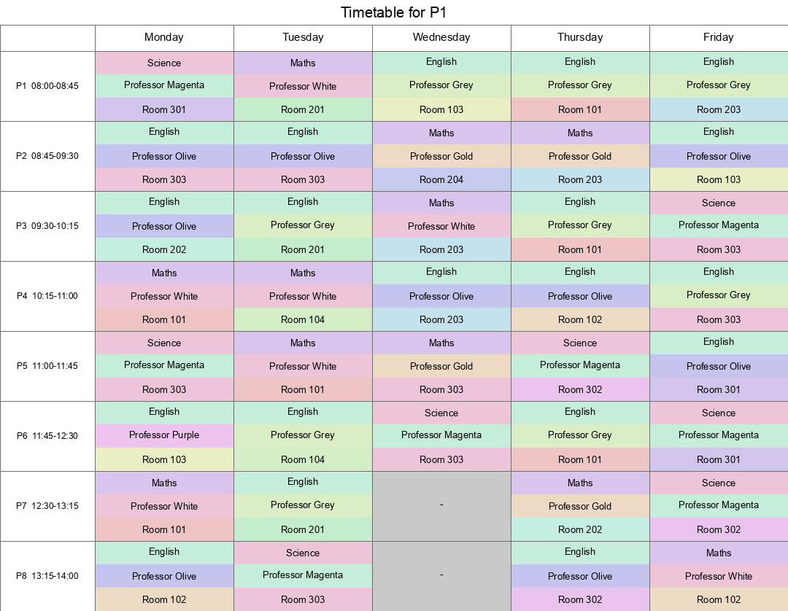
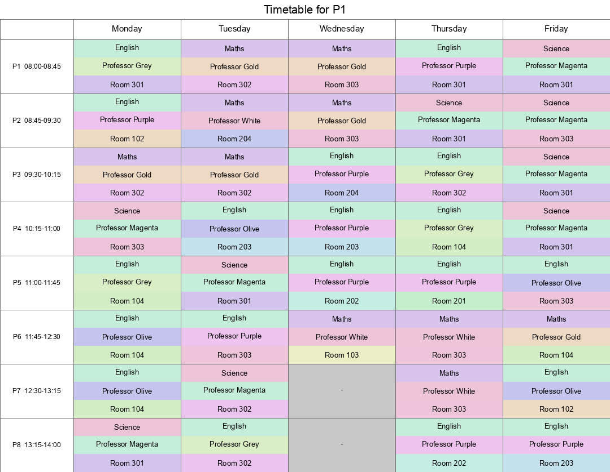

# From `x + 2 == 4` to a School Timetable: A Z3 Story

This is the story of how a folder of five-line Z3 warm-up scripts turned, one request at a time, into a working school timetabling system - complete with hard constraints, weighted soft preferences, colour-coded diagrams, and a couple of genuinely surprising lessons about what makes a constraint solver's life easy or hard.

If you don't know Z3: it's an SMT solver (Satisfiability Modulo Theories) from Microsoft Research. You don't tell it *how* to solve a problem - you describe the *rules* the answer has to obey, and it either hands you a valid answer or tells you none exists. That distinction - describing rules instead of writing an algorithm - is the thread running through everything below.

## Chapter 1: Hello, constraints

The very first script in this repo is about as small as Z3 gets:

```python
from z3 import *

x = Int('x')
solve(x + 2 == 4)
```

Run it, and Z3 says `[x = 2]`. Not exciting on its own, but it's already demonstrating the whole paradigm: no loop, no algorithm, just a fact about `x` that has to be true.

The next few scripts nudge that a little further - multiple variables and inequalities together:

```python
x, y = Ints('x y')
solve(x > 2, y < 10, x + 2*y == 7)
```

and a classic constraint-puzzle warm-up, buying exactly 100 animals for exactly 100 dollars:

```python
dog, cat, mouse = Ints('dog cat mouse')
solve(dog >= 1, cat >= 1, mouse >= 1,
      dog + cat + mouse == 100,
      1500 * dog + 100 * cat + 25 * mouse == 10000)
```

Still toy problems, but the shape of everything that follows is already visible: declare some variables, describe the rules, let the solver do the rest.

## Chapter 2: Finding *an* answer vs. finding the *best* answer

`making_change_dumb.py` asks Z3 for *any* way to make change for an amount using 5, 10 and 25 cent coins - a plain `Solver()`, one `check()`, done. It answers the question "is this possible?" but has no opinion about whether the answer it hands back is any good (it might use twelve coins when two would do).

`making_change.py` upgrades this to Z3's `Optimize()`, which adds `minimize()`/`maximize()` on top of the same constraint-solving machinery:

```python
o = Optimize()
o.add(Sum([coin_vars[i] * coins[i] for i in range(len(coins))]) == amount)
o.minimize(Sum(coin_vars))
```

That distinction - *a* solution vs. *the best* solution - turned out to matter for the rest of the project too, in ways that weren't obvious yet.

This script is also where the very first bug of the whole saga showed up, and it had nothing to do with Z3 at all: an `argparse` argument declared as `type=bool` doesn't parse `"False"` as `False` - `bool()` on any non-empty string is `True`. So calling the script with `False` on the command line silently meant "yes, force every coin to be used", which for a small amount had no solution at all. A good reminder that the solver is only as trustworthy as the constraints you actually feed it.

## Chapter 3: From coins to courses

The next step up was a small scheduling problem: given a list of courses with clashing time slots, find every combination of courses with no clashes, and separately, find the combination that maximises time spent in class.

The "find every combination" part introduced a technique used everywhere later on: Z3's `check()` only ever gives you *one* satisfying answer. To get *all* of them, you ask for one, then add a "not that one again" clause (a **blocking clause**) and ask again, repeating until it comes back `unsat`:

```python
while s.check() == sat:
    model = s.model()
    combinations.append(read_off(model))
    block = Or([Not(v) if is_true(model[v]) else v for v in course_vars])
    s.add(block)
```

This loop - solve, record, forbid, repeat - reappears later in a more sophisticated form when optimising the timetable itself.

## Chapter 4: The big leap - a real school timetable

This is where things got serious. The goal: given a set of classes (each with a list of subjects), teachers (each qualified for a handful of subjects), rooms, and a weekly grid of periods (Wednesday's a half day), produce a timetable where every class is taught one of its subjects, by a qualified teacher, in a room, every period - with nobody double-booked.

The core of the model is one variable trio per class per slot, and one constraint saying "the (subject, teacher) pair has to be one this class/teacher combination actually supports":

```python
s.add(Or([
    And(subject_var == s_idx, teacher_var == t_idx)
    for s_idx, t_idx in valid_subject_teacher_pairs[class_name]
]))
s.add(Distinct([teacher_vars[(c, day, period)] for c in class_names]))
s.add(Distinct([room_vars[(c, day, period)] for c in class_names]))
```

The first working version deliberately didn't try to be *good* - just *valid*. It found a complete, clash-free weekly timetable for 10 classes across 38 slots in about a second. That "just prove it's possible first" instinct - get to a correct, if unremarkable, answer before trying to make it better - turned out to be a good habit that paid off later.

## Chapter 5: Making it readable

A JSON file full of `{"subject": "Maths", "teacher": "Professor Gold", "room": "Room 101"}` is correct but useless to a human. The first fix was a markdown grid per class, teacher and room - periods down the side, days across the top.

Then came colour. The first attempt gave every one of the three values in a cell (subject, teacher, room) its own solid horizontal band:



It looked good in a screenshot, but it failed the actual test: could you glance at it and answer "when is this class in Room 102"? Three equally-weighted colours compete for attention, so nothing pops out - you have to consciously scan one specific stripe position across every single cell.

The fix was to stop treating all three values equally. The subject became the whole cell's pale background (the thing you're usually scanning for), the room became a bold, saturated accent bar down the left edge, and the teacher dropped to plain text with no colour at all - plus a small legend under the grid decoding both colour scales in use:


Now a repeated accent-bar colour down a column *is* the pattern "this class is often in this room" - no mental translation required.

## Chapter 6: Valid isn't the same as good

A timetable that satisfies every hard rule can still be a bad timetable - a teacher jumping between three different rooms in three consecutive periods, say, when they could easily have stayed in one. That needed a way to express *preferences*, not just *rules*, and - because preferences get added over time - a way to configure which ones apply on any given run without touching code.

The answer was two small JSON files. `optimisation.json` is a catalogue: an id, a plain-English description, and a default weight -

```json
"rule1": {
  "plaintext": "If a teacher stays in the same room for their next period, that is good.",
  "weight": 2
}
```

- and `optimisations.json` is *this run's* configuration: which of those ids are actually switched on, and what weight to give each. A rule not mentioned there simply isn't applied. Of course, plain English isn't something Z3 can execute, so every rule id also needs a matching Python function - a small registry mapping `"rule1"` to a Z3 expression that counts how often that pattern occurs:

```python
def rule_teacher_same_room_next_period(ctx):
    terms = []
    for day, period, next_period in ordered_period_pairs(ctx["days"]):
        for teacher_idx in range(len(ctx["teacher_names"])):
            room_now = teacher_room_expr(ctx, day, period, teacher_idx)
            room_next = teacher_room_expr(ctx, day, next_period, teacher_idx)
            terms.append(If(And(room_now != -1, room_next != -1, room_now == room_next), 1, 0))
    return Sum(terms)
```

The weighted sum of every active rule's count becomes the score to maximise. Once it's working, the effect is actually visible in the diagrams from Chapter 5: watch the accent-bar colour down a column of consecutive periods, and you can see the "stay in the same room" rule winning out in real time - Room 301's purple bar back-to-back on Monday periods 4 and 5 below, for instance, or Room 302's magenta on Wednesday periods 3 and 4:



Here's the part that genuinely surprised us. Z3's own `Optimize()` has a built-in `timeout`, and it's supposed to hand back the best solution found so far even if it times out before *proving* that's the best possible. In testing, it did return a model - but with 15 largely-interchangeable teachers and rooms, the timed-out model had left some variables unassigned, and completing them independently silently broke a hard rule: two classes ended up sharing the same teacher at the same time. A model that *looks* optimised but is secretly invalid is worse than no model at all.

The fix was to stop trusting `Optimize()`'s timeout entirely and do the search by hand with a plain `Solver()`: solve, note the score, add "give me something strictly better than that", solve again, repeat - and only ever keep an answer that came back as a genuine `sat`, never an `unknown`. Slower to set up, but every kept answer is guaranteed to be a real, fully valid timetable.

## Chapter 7: The optimiser's real enemy

With that search loop working, the natural next question was *why is finding the best answer so much slower than finding any answer at all?* One theory: every scoring rule only ever compares periods *within the same day* - nothing looks across days - so really this is five small independent problems being solved as one big one. Splitting the search by day should shrink the space Z3 has to explore.

It didn't help. In fact, solving day-by-day with five times the total time budget produced a *worse* combined score than one whole-week search. The real bottleneck wasn't the number of slots - it was the sheer interchangeability of a dozen-odd rooms and teachers *within any single slot*. An 8-period day has exactly the same symmetry problem as a 38-slot week; splitting the week up didn't touch it. It was a useful, if humbling, experiment: it's easy to guess wrong about *why* a solver is struggling.

## Chapter 8: A dash of realism

Up to this point any subject could be taught in any room, which is obviously not how schools work - Chemistry needs a lab, Art needs an art room. So `subjects.json` was added: a subject name mapped to the list of rooms that support it (an empty list meaning "no restriction"). Wiring that in was a single extra hard constraint per class-slot:

```python
s.add(Implies(subject_var == s_idx, Or([room_var == r_idx for r_idx in allowed_room_indices])))
```

Interestingly, this constraint didn't just add realism - it *helped* the optimiser too. Restricting Science, Biology, Chemistry and Physics to three shared rooms cut down exactly the kind of room symmetry Chapter 7 had identified as the real problem, and the optimiser's score went up as a side effect.

## Chapter 9: The fairness problem, and a genuine surprise about Z3

Adding a `teacher_load.json` report (how many lessons each teacher gets a week) surfaced an obvious problem: most teachers were booked for the maximum possible 38 lessons, while one - a Chemistry specialist, sharing a rarely-picked subject with four other qualified teachers - had just 7.

The instinctive fix was a **maximum**: cap everyone's load so the solver has to spread things out. It was, in hindsight, exactly the wrong instinct. Even a completely non-binding cap - "no more than 38", already true by construction - made Z3 time out, across three different ways of encoding it (native cardinality constraints, fresh boolean variables, plain arithmetic sums). Asking the solver to *prove an upper bound holds* across an already hugely symmetric search space turned out to be extremely expensive.

A **minimum** floor - "every teacher gets at least 15 lessons" - solved in about ten seconds. The asymmetry makes sense once you see it: a floor only asks the solver to find *enough* slots for someone, which is a cheap, constructive, existential question. A cap asks it to demonstrate that *no* arrangement exceeds a limit, across a search space riddled with equivalent ways of relabelling interchangeable teachers - a much harder negative to prove. Two constraints that sound like mirror images of each other turned out to have wildly different computational personalities.

The final approach split the difference: a hard minimum-load floor in the plain "just find a valid timetable" solver (fast, exact, guaranteed), plus a new soft rule in the optimiser rewarding each day's lessons being spread evenly across teachers - a best-effort nudge rather than a guarantee, since the optimiser only ever looks at one day at a time.

> **Update:** a later experiment porting this same model to Google OR-Tools' CP-SAT settled the question properly. The maximum cap wasn't just hard for Z3 - it was genuinely infeasible, and CP-SAT proved it in well under a second. Minimising each teacher's load individually revealed why: 8 of the 12 teachers are mathematically forced to teach every single one of the 38 periods, because a specific block of classes can only ever be covered by exactly those 8 people, with no qualification slack to spare. "Extremely expensive to prove" and "impossible" look identical from the outside when a solver times out - it took a second solver to tell them apart.

## Where that leaves things

The finished system, walking backwards from that first `solve(x + 2 == 4)`:

- a hard-constraint model of an entire school week (classes, teachers, rooms, subjects, room compatibility, no double-booking, a minimum load per teacher)
- a configurable, weighted soft-optimisation layer, driven entirely by two small JSON files, extensible by adding a rule id and a matching Python function
- a bounded, correctness-first search loop that never trusts a model it can't verify
- markdown and colour-coded PNG diagrams per class, teacher and room, designed around a single question: can you glance at this and see the pattern you're looking for?

The same 12 lines of Z3 from Chapter 1 - declare variables, describe rules, ask for a model - are still exactly what's happening underneath all of it. Everything since then has just been about which rules are worth stating, and learning, sometimes the hard way, which ways of stating them a solver can actually chew through.
